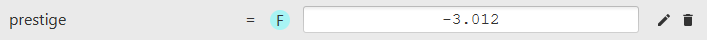
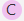
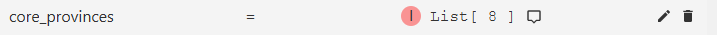
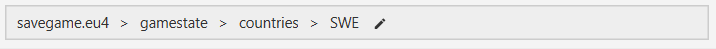
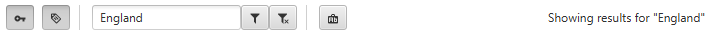
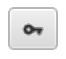

## Structure

A savegame consists out of many entries, where each entry has a name,
also called the key, and an associated value.
They are formatted as `<key name> = <value>` pairs and look like this:

The associated values can be of one of the following primitive types:

Boolean, either <i>yes</i> or <i>no</i>

Integer, e.g. <i>124</i>

Floating point number, e.g. <i>1.12</i>

Text, e.g. <i>"Text value"</i>

A game specific value, e.g. the relgion id <i>catholic</i> in eu4.
While it looks like a normal Text value, the difference is
that you can basically assign anything to a text value while
you can only assign certain things to a game specific value without breaking the game

Color

### Lists

A value can also be a list of any type of the ones listed above and would look like this:

You can open the list contents by clicking on it.

Complex type, assigned if a list contains key-value pairs on its own, its type is described as complex

A button that you can hover over to get a preview of the list contents in text form.

## aaa

## Navigation

The navigation bar located at the top shows you exactly
where you currently are in your savegame and also allows you go back up.
It looks like this:

## Filters

Since savegames contain thousands of entries, it is basically required
to use filters in order to find entries that you are looking for.
The filter bar is located at the bottom and looks like this:

The search string can be entered into the text field.
To apply a search string, you have to press **Enter**.
On the right, the **Showing results for ...** label shows the currently active filter
The various buttons on the bar have the following usages:

A toggle button to include keys in the search.
Key names are located to the left of the equal sign of an entry.

A toggle button to include values in the search.
The values are the objects located to the right of the equal sign of an entry.

Applies the filter string in the text field.
Alternatively, you can press **Enter** after typing your search string.

Clears the active filter.

Toggles case-sensitive matching mode for the search string.

