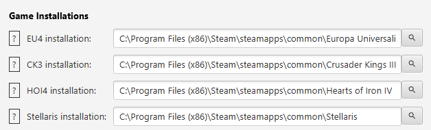

# Pdx-Unlimiter Guide

## Table of Contents

- [Game Installations](#game-installations)
- [Importing savegames](#savegame-importing-and-storage)
- [Managing campaigns and folders](#campaigns-and-folders)
- [Managing savegames](#savegames)
- [Launching savegames](#launching-savegames)
- [Other things to do with savegames](#savegame-actions)
- [How to savescum](#savegame-checkpoints-and-savescumming)
- [Accessing the raw savegame files](#working-with-the-raw-savegame-files)
- [Troubleshooting](#troubleshooting)

## Game Installations

Upon installation of the Pdx-Unlimiter, you probably have a couple of Paradox games
installed where each one has saved a lot of savegames to your computer.
These are either saved in your **Documents** directory or your Steam cloudsave directories.
The Pdx-Unlimiter will try to automatically detect any of those game installations and save game directories.

Note that only relatively up-to-date installations of Paradox games with the Paradox Launcher are supported.
If any installation is not detected, you can set them manually in the settings menu:

## Savegame importing and storage

The Pdx-Unlimiter has an internal savegame storage that is
independent of the savegame directories of your installed games.
To manage a savegame with the Pdx-Unlimiter, you therefore first have to import it.
There are several different ways of doing that:

- By clicking the **Import** button in the menu bar, which will open a separate import window.
- Dragging and dropping the savegame files into the Pdx-Unlimiter window.
  This also works for folders that contain savegames.
- Double clicking any savegame file if its extension is associated with the Pdx-Unlimiter.
  This includes `.eu4` `.hoi4`, `.ck3` and `.sav` files.

For performance reasons and to prevent the storage from bloating, you have to explicitly
import any savegame that you want to manage, i.e. it will not
automatically import all the contents of your savegame directories.
This separation means that changing or deleting a file from your savegame directory
does not delete it from the Pdx-Unlimiter storage and vice-versa.

You can change the internal storage directory in the settings menu and
also open it in the file explorer by clicking on **Storage** -> **Open storage directory** in the menu bar.

## Campaigns and folders

When you import savegames, they are automatically grouped by identifying
other savegames that belong to the same campaign playthrough.
These campaigns are shown on the left and look like this:

In addition to campaigns, you can also create folders by clicking on the **Add Folder** button
shown in the picture.
A folder is meant to store various savegames that might belong to entirely different campaigns.
An example is the generated **Melted Savegames** folder that stores any converted Ironman savegame.
To move savegames into a folder, just drag and drop them there.

At the top there is also a search bar that you can use to quickly find specific campaigns or savegames.
The campaign name can be edited by clicking on it.
You can also delete an entire campaign by clicking on the **Delete** button.

The campaigns and folders below are ordered by
how recently a savegame of that campaign was launched from the Pdx-Unlimiter.
A campaign will automatically go to the top of the list if you launch a savegame from it.

## Savegames

You can open a campaign or folder by clicking on it.
Then you can see the contained savegames, ordered by their in-game dates.
A savegame entry looks like this:

All savegame entries contain some information about their current state of the game
to make it easier for you to identify the right one to use.
They also have a name, visible at the top center.
This name can be changed, by clicking on it.

A savegame entry behaves like a normal file in the sense that
if you want to move a savegame to another campaigns or folder,
you can do so by dragging and dropping into it.

## Launching savegames

If you click on a savegame entry, a status bar will pop up from the bottom.
It usually looks like this:

By clicking the **Export** button in the status bar,
you can copy the savegame into the savegame directory of the current game.
This will however not launch the game automatically.

You can also launch the selected savegame directly by clicking the **Continue Game** button.
This direct launch will automatically attempt to enable every required mod and dlc.
This will bypass the Paradox launcher and main menu, i.e. saving a lot of time.

**Start Launcher** will start your active launcher, usually the Paradox Launcher,
in which you can then click **Continue Game** to launch the selected savegame.
This is useful, if you want to change your mod or dlc configurations.

If some content is missing, or the game version is not compatible, a red status bar will be shown.
You can still launch the savegame, but you will get a warning about which mod or dlc is missing.

## Savegame Actions

The icon buttons located at the top right of a savegame entry
indicate what kind of actions you can perform with it.
These buttons perform the following actions:

Ironman converter, only available for Ironman savegames. This allows you to
convert ironman savegames into non-ironman savegames, also called 'melting'.

Copy functionality. This is useful to create backup copies before editing a savegame.

Opens the <a href="https://github.com/Osallek/Eu4SaveEditor">Eu4SavegameEditor</a>,
a very user friendly editor with a map based interface.
It is only available for Non-Ironman EU4 savegames of the latest game version.
To have access to it, you first need to enable it in the settings menu.

Opens the Pdx-Unlimiter savegame editor, only available for Non-Ironman savegames.
You can use this text based editor, if the Eu4SaveEditor is not available or you need advanced editing features.

Uploads the savegame to https://rakaly.com to analyze it.
For this to work, you first have to set your Rakaly.com <b>User ID</b> and <b>API key</b> in the settings menu.

Uploads the savegame to https://skanderbeg.pm to generate maps.
For this to work, you first have to set your skanderbeg.pm <b>API key</b> in the settings menu.

Add a note to the savegame that can pop up when you launch the savegame the next time.

Deletes the savegame.

## Savegame checkpoints and savescumming

In case of any unfortunate ingame event that you want to revert,
the Pdx-Unlimiter gives you the ability to savescum, i.e. reverting to a
previous savegame checkpoint while playing in Ironman.
While playing a supported game, a status bar that looks like will pop up:

A savegame checkpoint can be created/imported at any time while being ingame by
clicking on **Import** button or pressing `CTRL+SHIFT+I`.
This will import the latest savegame, shown in the center of the status bar.

By pressing either `CTRL+SHIFT+K` or **Kill** in the status bar,
you can kill the currently running game without it having a chance to overwrite the latest savegame.
You can simply select your latest imported savegame in the Pdx-Unlimiter and launch it again.

If you just want to revert to the latest saved savegame a couple of months back,
you can also use `CTRL+SHIFT+R` to combine the **Import** and **Kill** functions,
i.e. import the latest savegame, kill the game process and launch it again.

### Settings

In the settings menu you can also enable time-based autoimports of savegames:
- `Enabled timed imports` - Enables automatically importing the latest
  savegame after a certain time has passed while playing.
- `Timed imports interval` - The interval between automatic imports in minutes.

If a key combination to import is pressed, a confirmation sound
will play if the following option is enabled in the settings menu:
- `Play sound on background import` - Play a beep sound when importing a savegame
  while a game is open and the Pdx-Unlimiter is running in the background.

## Working with the raw savegame files

When you import a savegame, its original savegame file is copied into the Pdx-Unlimiter storage.
If you want to access that savegame file after importing it, you can easily do so, since
a savegame entry in the Pdx-Unlimiter behaves like a normal file in the sense that
you can drag and drop it as you would do with a normal file.
So you can drag a savegame from the GUI outside the Pdx-Unlimiter window and drop it anywhere as a file.

You can also export all savegame files of the entire storage into a directory
by clicking **Storage** -> **Export storage...** in the menu bar at the top.
This can be useful to backup your savegame collection or transfer it between different computers.

## Automatic updates

The Pdx-Unlimiter comes with an autoupdate functionality.
Whenever you launch the Pdx-Unlimiter, it will check for a new version and download it if it exists.
There are several reasons why this was implemented:

- There are currently four supported games where each game gets regular updates.
  In order to maintain support for each of them, new versions of the Pdx-Unlimiter have to be frequently distributed
- To eliminate bugs of course
- The file format of Paradox games is undocumented and messy, therefore
  there will always be unexpected cases that have to be fixed
- Windows SmartScreen makes manual updates unnecessary difficult since each new version is flagged as untrusted.
  You can read more about this [here](https://www.coretechnologies.com/blog/windows/microsoft-smartscreen-filter/)
  
If you want to disable this feature, you can do so in the settings menu.

## Troubleshooting

In case of any problems, you can do the following:

- Use the automatic report functionality of the error reporter if it comes up
- You can also open the issue reporter at **Help** -> **Report issue** in the menu bar
- Alternatively, you can also open an issue on GitHub and describe the error
  in more detail or visit the Pdx-Unlimiter Discord server
- If the application does not even start, or you want to dig deeper into the error cause,
  you can find the different log files at `<documents directory>\Pdx-Unlimiter\logs`
  on Windows and `~/.local/share/.pdx-unlimiter/logs` on Linux.
  (If you are an older user, your install path may be your home directory instead of the documents directory)
  
