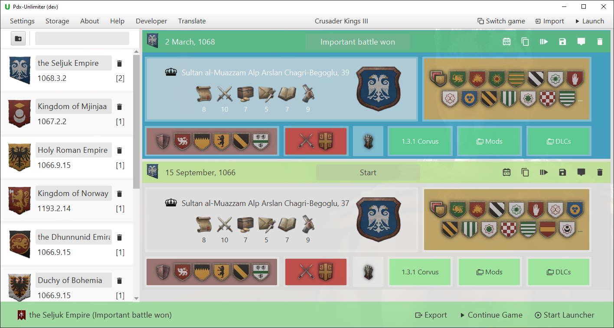
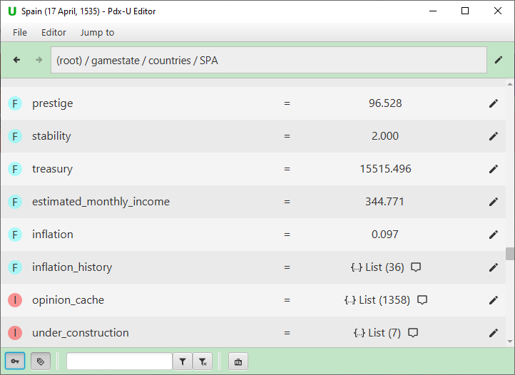

<h1 align="center">
   
</h1>

The Pdx-Unlimiter is a tool for all major Paradox Grand Strategy games that provides a
powerful and smart savegame manager to quickly organize and play all of your savegames with ease.
Furthermore, it also comes with an Ironman converter,
a powerful savegame editor, some savescumming tools, integrations for various other
great community-made tools, and full support for the following games:

* Europa Universalis IV
* Crusader Kings III
* Hearts of Iron IV
* Stellaris

# Download

Note that there might be some issues with Windows SmartScreen blocking the executable after downloading.
If you are facing these issues, click on "More info" and then "Run anyway".
You can read [this StackExchange post](https://security.stackexchange.com/a/139520) if you want to understand
why this warning pops up.

### Installers

Installers are the easiest way to get started.
They set up everything automatically and also come with an automatic update feature,
which you can also disable in the settings if you want.

- [Windows Installer](https://github.com/crschnick/pdxu_launcher/releases/latest/download/pdxu_installer-windows.msi)
- [Linux .deb Installer](https://github.com/crschnick/pdxu_launcher/releases/latest/download/pdxu_installer-linux.deb)
- [Linux .rpm Installer](https://github.com/crschnick/pdxu_launcher/releases/latest/download/pdxu_installer-linux.rpm) (Experimental for now)

### Standalone

If you don't like installers, you can also use a standalone version, which is packaged in a .zip archive.
This version does not come with an update functionality, so you have to manually download new releases if you want to update.

- [Windows standalone](https://github.com/crschnick/pdx_unlimiter/releases/latest/download/pdx_unlimiter-windows.zip)
- [Linux standalone](https://github.com/crschnick/pdx_unlimiter/releases/latest/download/pdx_unlimiter-linux.zip)

You can also find information on how to obtain pre-releases and the latest development builds in
the [Downloads](https://github.com/crschnick/pdx_unlimiter/wiki/Downloads) section in the wiki.

# Features

The main components of the Pdx-Unlimiter are:
- [Savegame manager](#savegame-manager)
- [Smart savegame launcher](#smart-launcher)
- [Ironman converter](#ironman-converter)
- [Savegame editor](#savegame-editor)
- [Savescumming tools](#savescumming-tools)
- [Integrations for other Paradox tools](#third-party-tool-integration)

If you want to know how to use a certain feature, you can
read about it in the [Pdx-Unlimiter Guide](https://github.com/crschnick/pdx_unlimiter/wiki/User-Guide).
There is also a short [FAQ page](https://github.com/crschnick/pdx_unlimiter/wiki/Frequenly-Asked-Questions)
to answer some of your questions.

## Savegame manager

Since keeping track of all your savegames is getting more complicated
with every new savegame you start or backup you revert to,
the Pdx-Unlimiter provides you with an easy-to-use interface for choosing the right save file of a campaign.
This is done by collecting all savegames and creating a browsable and editable
savegame history so you can load any prior saved version of a campaign.
All types of savegames are supported, including Ironman and modded savegames.
The smart launcher also allows you instantly continue a savegame
without having to visit the Paradox Launcher or main menu.

**Usage guide:** [Savegame management](https://github.com/crschnick/pdx_unlimiter/wiki/User-Guide#savegame-importing-and-storage)

## Smart launcher

The problem of playing modded savegames it that you always need to enable the right mods in the Paradox Launcher.
It can become tedious to always keep track of which mods are required by which savegame.
The solution to this problem is that the Pdx-Unlimiter is a *smart* launcher
that is fully aware of which mods and DLCs are needed for a certain savegame,
*before* you start the game.

All savegames can be launched directly from
within the Pdx-Unlimiter without needing to visit the in-game main menu ever again.
When you directly launch a savegame from within the Pdx-Unlimiter,
the required mods and DLCs are automatically enabled without having to use Paradox launcher configurations.
It is also checked whether a mod is missing or incompatible with the current version,
so that nothing can potentially corrupt your savegames.
This means that you never have to worry about keeping track of your mod
configurations if you regularly switch between them.
Skipping the main menu also saves a lot of time when loading a savegame.

**Usage guide:** [Launching savegames](https://github.com/crschnick/pdx_unlimiter/wiki/User-Guide#launching-savegames)

## Savegame editor

The Pdx-Unlimiter also comes with a savegame editor,
which can also be used as a savegame navigator to quickly find certain entries in a savegame.
With this editor you can edit any file that is saved in a Paradox text format.
This includes EU4 and CK3 non-ironman savegames, all Stellaris savegames, and
any game data files for mods and other purposes.
You can use the included [Ironman converter](#ironman-converter) to also edit converted Ironman savegames.

The editor supports multiple different styles of editing savegame files.
The first one, the more simple version, allows you to edit already existing values for entries.
It is meant for users that are new to savegame editing, is relatively user-friendly,
and tries to prevent users from making savegames invalid or corrupt.
The second editing style allows you to use your
favourite text-editor and to completely change the data structure if wanted.
Using the Pdx-Unlimiter editor has the following benefits:

- You don't have to deal with compressed savegames, the editor does all
  the extracting and repackaging of zipped savegame files for you
  
- The editing process is broken down into editing smaller parts of the savegame.
  You can still use your favourite text editor to edit smaller parts of the savegame
  and therefore don't have to open and edit >50 MB files in your text-editor

- You can easily navigate the hierarchical data with filters compared to the
  laborious process of locating a specific entry with a text editor search function
  
- The editor can visualize certain data entries and provide more context.
  The most prominent example would be the coat of arms preview for CK3 savegames

**Usage guide:** [Editing savegames](https://github.com/crschnick/pdx_unlimiter/wiki/Editor-Guide)

## Ironman converter

Internally, the Pdx-Unlimiter uses the [pdx.tools](https://pdx.tools/) melter to convert
any ironman savegame into a text-based, non-ironman savegame.
It provides an easy-to-use frontend for the pdx.tools Ironman converter,
i.e. a graphical user interface to convert your own
ironman savegames into playable and editable non-ironman savegames.

This is useful if you have ever encountered a situation in which you wanted to
create a non-ironman copy of an ironman savegame, but couldn't because the games don't let you do it.
You can for example use the included ironman converter
to first create a non-ironman savegame and then edit it using the [Savegame editor](#savegame-editor).
Moreover, you can also use the in-game console when playing converted savegames.

**Usage guide:** [Ironman Converter](https://github.com/crschnick/pdx_unlimiter/wiki/User-Guide#savegame-actions)

## Savescumming tools

The Pdx-Unlimiter allows you to create savegame checkpoints using the GUI or keyboard shortcuts
while being ingame.
Having a history of previous savegames of your campaign available protects
you against bugs, glitches, and terrible luck that can easily ruin campaigns.
You can also enable a timed checkpoint option in the settings that will
automatically create a campaign checkpoint every *x* minutes.

If you want to load a previous savegame checkpoint,
you can also kill the currently running Paradox game and load the latest save using a keystroke.
This feature also allows you to easily savescum, which is kinda necessary for hard achievements.

**Usage guide:** [Savescumming](https://github.com/crschnick/pdx_unlimiter/wiki/User-Guide#savegame-checkpoints-and-savescumming)

## Third party tool integration

The Pdx-Unlimiter is also built as an application that gives you easy access to many
other great community-made tools.
The supported tools are:

- [PDX Tools](https://pdx.tools),
  a website to analyze and share your eu4 achievements and compete against other players.
  It is possible to analyze your EU4 savegames on PDX Tools with just one click without having to upload them.

- [Skanderbeg](https://skanderbeg.pm),
  a website to generate maps and statistics for your savegames.
  It is possible to upload your EU4 savegames to skanderbeg with just one click.

- The [CK3 to EU4 converter](https://github.com/ParadoxGameConverters/CK3toEU4).
  This means that you can interact with the converter from within the Pdx-Unlimiter
  and basically convert any managed savegame with just one click as well.

- The [Irony Mod Manager](https://bcssov.github.io/IronyModManager/), which can
  replace the mod-management capabilities of the Paradox launcher, can be designated to be used
  as the default launcher instead of the Paradox launcher.

**Usage guide:** [Savegame tools](https://github.com/crschnick/pdx_unlimiter/wiki/User-Guide#savegame-actions)

# Community and Support

If you have suggestions, need help, ran into any issues or just want to talk to other friendly people,
you can join the [Pdx-Unlimiter Discord](https://discord.gg/BVE4vxqFpU).

# Development

To build this project, [JDK 17](https://openjdk.java.net/projects/jdk/17/) is required.
You can build the gradle project using the gradle wrapper with `gradle/gradlew build` or `gradle\gradlew.bat build`.
For running, you can use `gradle/gradlew run`.
Note here that the gradle wrapper has been moved into the `gradle` subdirectory.
You can use the automatically generated file `pdxu.properties`, which is created when gradle is run the first time,
to set some useful development options when needed.

Further, note that as this is a pretty complicated Java project that fully utilizes modularity,
many IDEs still have problems building this project properly.
For example, you can't build this project in eclipse or vscode as it will complain about missing modules.
The tested and recommended IDE is intellij.

Any contribution is welcomed!
There are no real formal contribution guidelines right now, they will maybe come later.
