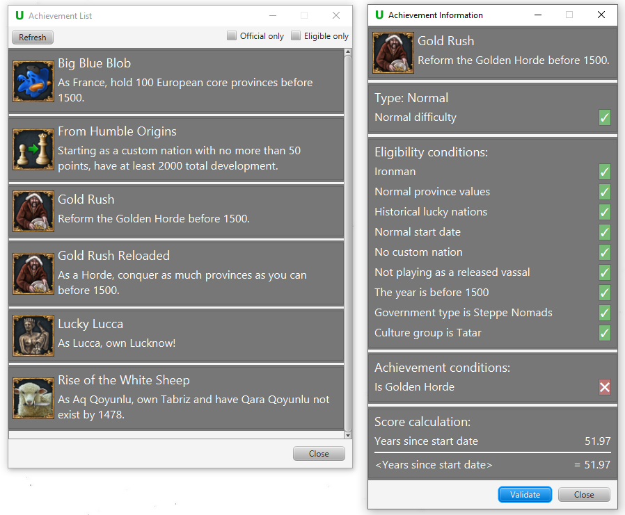

# Pdx-Unlimiter

## Features

### Savegame management for Paradox games

Since keeping track of all your savegames is getting more complicated with every new savegame you start or backup you revert to,
the Pdx-Unlimiter provides you with an easy to use interface for choosing the right save file.
This is done by collecting all savegames and creating a browsable and editable savegame history so you can load any prior saved version of
a campaign. 
This works for both Ironman and Non-Ironman savegames.
All savegames can be also launched directly from within the Pdx-Unlimiter without needing to vist the main menu.

Supported games: EU4, HOI4, Stellaris, CK3

### Reverting savegames

If you are ingame and the Pdx-Unlimiter is running, you can import the latest saved savegame any time.
If you want to revert to a previously imported savegame, you can kill the currenty running Paradox game and load the latest save.
This kind of manual savegame management for ironman games allows you to easily revert to previous saves,
i.e. to savescum, which is kinda necessary for hard achievements.

### Custom achievements and challenges

Every imported save game is parsed and converted into a more readable and usable json format internally.
This allows for operations on these savegames such as custom achievement creation and validation.
If you are interested in creating and sharing your own achievements,
visit [the achievement repository](https://github.com/crschnick/pdxu_achievements) for a documentation.

### Full Mod support

Savegames that use mods are also fully supported.
This includes displaying modded country information in the savegame manager and mod installation support.
When you launch a savegame from within the Pdx-Unlimiter, exactly the required mods and DLCs are automatically
enabled without having to use Paradox launcher configuration.
It is also checked whether a mod is missing or incompatible with the current version, so that nothing can potentially corrupt your savegames.

## Planned features

### Gameplay assistance

Every imported savegame date is parsed and converted into a more readable and usable json format and therefore
would allow the Pdx-Unlimiter to take over some of the tedious micromanagement,
e.g. building buildings, converting or razing all provinces, and carpet sieging provinces.

Status: Planned

## Contributing

You can help the project by reporting issues, fixing bugs and making the planned issues a reality.
Contributing guidelines coming soon. 
This project is only in its infancy and only a handful of features are currently included,
however the solid foundation needed for more planned features already exists.
The current focus primarily lies on perfecting already existing features.

## Building and running

To build this project, [OpenJDK 15](https://openjdk.java.net/) is required.
You can build the project with `gradlew build` or `gradlew.bat build`.
To create jlink images and installers, use `gradlew createDist`.
For running, you can use `gradlew run`.
To correctly run the Pdx-Unlimiter in a development environment, you need to set the property `installDir=<installation directory>`
in the `pdxu.properties` file. This is needed for a dev build to simulate the program operating
in a real installation directory and not in the build directory.
