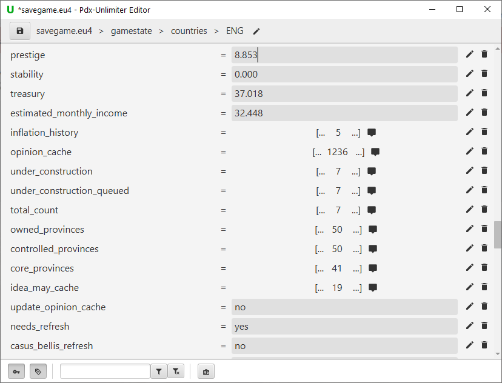

The Pdx-Unlimiter is a tool for various Paradox games that provides a powerful savegame manager that allows
you to organize, filter, and play all of your savegames with ease.
Furthermore, it also comes with the ability to convert savegames to a non-ironman version,
a powerful savegame and game data file editor, some savescumming tools, and integrations for various
other great community-made tools like 
[Rakaly](https://rakaly.com), [Skanderbeg](https://skanderbeg.pm) and the
[CK3 to EU4 converter](https://github.com/ParadoxGameConverters/CK3toEU4).
Currently, the following games are supported:

- Europa Universalis IV
- Crusader Kings III
- Hearts of Iron IV
- Stellaris

## Download

### [Windows Installer](https://github.com/crschnick/pdxu_launcher/releases/latest/download/pdxu_installer-windows.msi)

Note that there might be some issues with Windows SmartScreen blocking the installer.
If you are facing these issues, click on "More info" and then "Run anyway".

### [Linux .deb Installer](https://github.com/crschnick/pdxu_launcher/releases/latest/download/pdxu_installer-linux.deb)

# Features

The main components of the Pdx-Unlimiter are:
- [Savegame manager](#savegame-manager)
- [Ironman converter](#ironman-converter)
- [Savegame editor](#savegame-editor)
- [Savescumming tools](#savescumming-tools)
- [Integrations for other Paradox tools](#third-party-tool-integration)

It you want to know how to use a certain feature, you can just
read the [Pdx-Unlimiter Guide](https://github.com/crschnick/pdx_unlimiter/blob/master/docs/GUIDE.md).
There is also a short [FAQ page](https://github.com/crschnick/pdx_unlimiter/blob/master/docs/faq.md)
to answer some of your questions.

## Savegame manager

Since keeping track of all your savegames is getting more complicated
with every new savegame you start or backup you revert to,
the Pdx-Unlimiter provides you with an easy-to-use interface for choosing the right save file.
This is done by collecting all savegames and creating a browsable and editable
savegame history so you can load any prior saved version of a campaign. 
This works for both Ironman and Non-Ironman savegames.
All savegames can be also launched directly from
within the Pdx-Unlimiter without needing to visit the main menu.

Savegames that use mods are also fully supported.
This includes displaying modded country information in the savegame manager and mod installation support.
When you launch a savegame from within the Pdx-Unlimiter, the required mods and DLCs are automatically
enabled without having to use Paradox launcher configurations.
It is also checked whether a mod is missing or incompatible with the current version,
so that nothing can potentially corrupt your savegames.

## Savegame editor

The Pdx-Unlimiter also comes with a savegame editor.
With this editor you can edit any file that is saved in a Paradox text format.
This includes EU4 and CK3 non-ironman savegames, all Stellaris savegames, and
any game data files for mods and other purposes.

The editor supports two different styles of editing savegame files.
The first one, the more simple version, allows you to edit already existing values for entries.
It is meant for users that are new to savegame editing, is relatively user-friendly,
and tries to prevent users from making savegames invalid or corrupt.

The second editing style, a more advanced version, allows you to use your
favourite text-editor to completely change the data structure if wanted.
Even though as an advanced user you already edited Paradox text format files
with a text editor, using the Pdx-Unlimiter editor has the following advantages:

- You don't have to deal with compressed savegames, the editor does all
  the extracting and repackaging of zipped savegame files for you
  
- The editing process is broken down into editing smaller parts of the savegame.
  You can still use your favourite text editor to edit smaller parts of the savegame
  and therefore don't have to open and edit >50 MB files in your text-editor

- You can easily navigate the hierarchical data with filters compared to the
  laborious process of locating a specific entry with a text editor search function

## Ironman converter

Internally, the Pdx-Unlimiter uses [Rakaly](https://github.com/rakaly) tools to convert
any ironman savegame into a text-based, non-ironman savegame.
It also provides an easy-to-use frontend for the Rakaly converter,
i.e. a graphical user interface to convert your own
ironman savegames into playable and editable non-ironman savegames.

This is useful if you have ever encountered a situation in which you wanted to
create a non-ironman copy of an ironman savegame, but couldn't because the games don't let you do it.
You can for example use the included ironman converter
to first create a non-ironman savegame and then edit it using the [Savegame editor](#savegame-editor).

## Savescumming tools

The Pdx-Unlimiter allows you to create a sort of savegame checkpoints
using keyboard shortcuts while being ingame that you can always revert back to.
If you want to revert to a previous savegame checkpoint,
you can also kill the currently running Paradox game and load the latest save using a keystroke.
This feature allows you to easily savescum, which is kinda necessary for hard achievements.

## Third party tool integration

The Pdx-Unlimiter is also built as an application that gives you easy access to many
other great community-made tools.
The supported tools are:

- [Rakaly](https://rakaly.com),
  a website to analyze and share your eu4 achievements and compete against other players.
  It is possible to upload your EU4 savegames to rakaly and analyze them from there.

- [Skanderbeg](https://skanderbeg.pm),
  a website to generate maps and statistics for your savegames.
  It is possible to upload your EU4 savegames to skanderbeg with just one click.

- The [CK3 to EU4 converter](https://github.com/ParadoxGameConverters/CK3toEU4).
  This means that you can interact with the converter from within the Pdx-Unlimiter
  and basically convert any managed savegame with just one click as well.

## Community and Support

If you have suggestions, need help, run into any issues or just want to talk to other friendly people,
you can join the [Pdx-Unlimiter Discord](https://discord.gg/BVE4vxqFpU).
You can also help the project by reporting issues, fixing bugs and making the planned issues a reality.

## Development

To build this project, [JDK 15](https://openjdk.java.net/projects/jdk/15/) and gradle is required.
You can build the gradle project with `gradlew build` or `gradlew.bat build`.
For running, you can use `gradlew run`.

To correctly run the Pdx-Unlimiter in a development environment,
you can set the property `dataDir` in the `pdxu.properties` file to any directory such that your development
environment does not interfere with your Pdx-Unlimiter installation data.
If not set, the data directory of your Pdx-Unlimiter installation is used.

Any contribution is welcomed!
There are no real formal contribution guidelines right now, they will maybe come later.
