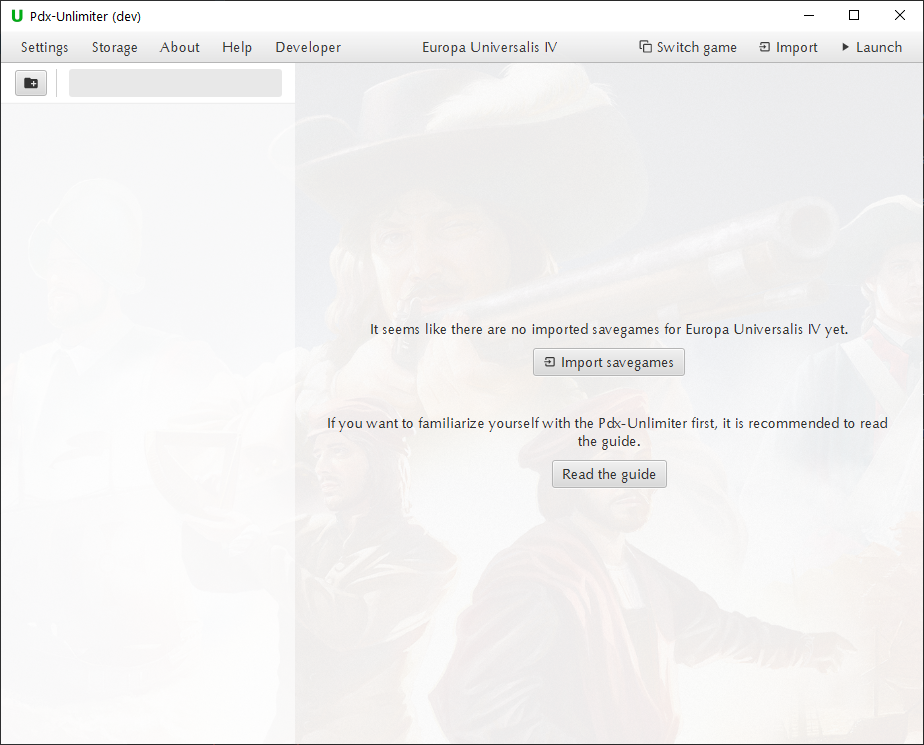
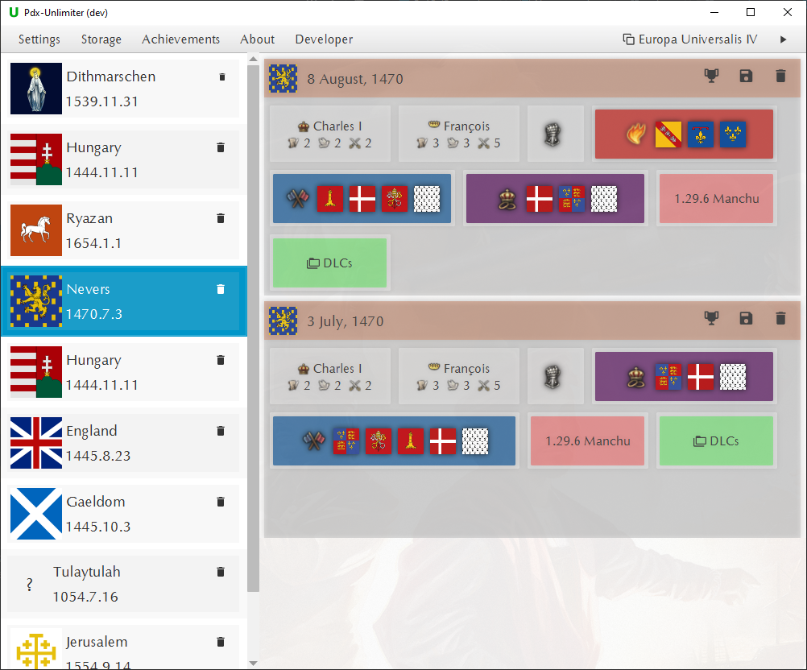
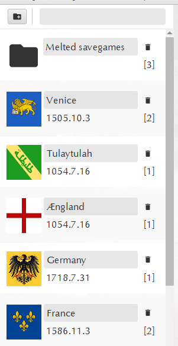
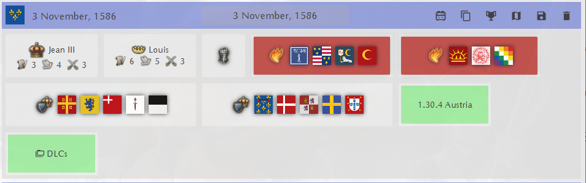
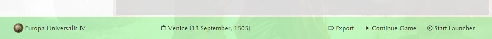
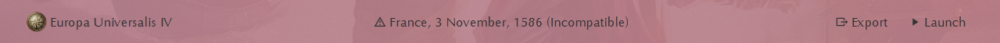
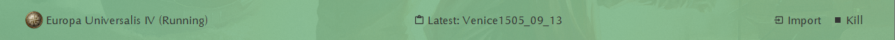

# Pdx-Unlimiter Guide

The savegame manager interface will initially look pretty empty.
This guide will show you first how to populate the Pdx-Unlimiter with your savegames,
i.e. go from the left picture to the right picture.
Afterwards, this guide will show you how to make the best use of all the functions, the Pdx-Unlimiter provides.

&nbsp;

&nbsp;

&nbsp;

&nbsp;

&nbsp;

&nbsp;

&nbsp;

&nbsp;

&nbsp;

&nbsp;

## Table of Contents

- [Game Installation detection](#game-installations)
- [Importing savegames](#savegame-storage)
- [Managing campaigns and folders](#campaigns-and-folders)
- [Managing savegames](#savegames)
- [Launching savegames](#launching-savegames)
- [Other things to do with savegames](#savegame-actions)
- [How to savescum](#savescumming)

## Game Installations

Upon installation, you probably have a lot of savegames of different Paradox games on your computer,
either saved in your documents directories or your Steam cloudsave directories.
The Pdx-Unlimiter will try to automatically detect any of those game installation and save game directories.
If any installation is not detected, you can set them manually in the settings menu.
Note that only up-to-date installations of Paradox games with installed Paradox Launcher are supported!

## Savegame storage

The Pdx-Unlimiter has an internal savegame storage that is
independent of these savegame directories of your installed games.
To manage a savegame with the Pdx-Unlimiter, you therefore first have to import it.
There are several different ways of doing that:

- By clicking the import button in the menu bar, which will open a separate import dialog
- Dragging and dropping the savegame files into the Pdx-Unlimiter. This also works for folders that contain savegames
- Pressing `CTRL+SHIFT+I` while a supported game is open will import the latest savegame.
  This also works if the game is in fullscreen mode
  If the key combination is pressed, a confirmation sound will play
- Double clicking any savegame file if its extension is associated with the Pdx-Unlimiter.
  This includes `.eu4` `.hoi4`, `.ck3` and `.sav` files.

For performance reasons and to prevent the storage from bloating, you have to explicitly
import any savegame that you want to manage.
This separation means that changing or deleting a file from your savegame directory
does not delete it from the Pdx-Unlimiter storage and vice-versa.

In the settings menu you can change the storage location and
enable the option `Delete on import` which specifies
whether to delete savegames after succesfully importing it into the Pdx-Unlimiter storage.

## Campaigns and folders

When you import savegames, they are automatically grouped by identifying
other savegames that belong to the same campaign playthrough.
These campaigns are shown on the left and look like this:

In addition to campaigns, you can also create folders by clicking on the **Add Folder** button
shown in the picture.
Next to it is a search bar that you can use to quickly find specific campaigns or savegames.
A folder is meant to store various savegames that might belong to entirely different campaigns.
An example is the **Melted Savegames** folder that stores any converted Ironman savegame.

The campaigns and folders are ordered by how recently a savegame
of that campaign was directly launched from the Pdx-Unlimiter.

The campaign name can be edited by clicking on it.
You can also delete an entire campaign by clicking on the **Delete** button.

## Savegames

By clicking on a campaign or folder, you can see the contained savegames, ordered by their in-game dates.
A savegame entry looks like this:

All savegame entries contain some information about their current state of the game
to make it easier for you to identify the right one to use.
They also have a name, visible at the top center.
This name can be changed, by clicking on it.

A savegame entry behaves like a normal file in the sense that
you can drag and drop it as you would do with a normal file.
You can drag a savegame from the GUI outside the Pdx-Unlimiter window and drop it anywhere as a file.
If you want to move a savegame to another campaigns or folder, you can also do so dragging and dropping it there.

### Launching savegames

If you click on a savegame entry, a status bar will pop up from the bottom.
It usually looks like this:

By clicking the **Export** button in the status bar,
you can copy the savegame into the savegame directory of the current game.
This will however not launch the game automatically.

You can also launch the selected savegame directly by clicking the **Launch** button.
This direct launch will automatically attempt to enable every required mod and dlc.
This will bypass the Paradox launcher and main menu, i.e. saving a lot of time.

If some content is missing, or the game version is not compatible, a red status bar will be shown.
You can still launch the savegame, but you will get a warning about which mod or dlc is missing.

### Savegame Actions

The icon buttons located at the top right of a savegame entry
indicate what kind of actions you can perform with it.
These buttons perform the following actions:

Ironman converter, only available for Ironman savegames. This allows you to
convert ironman savegames into non-ironman savegames, also called 'melting'.

Copy functionality. This is useful to create backup copies before editing a savegame.

Opens the savegame editor.

Uploads the savegame to https://rakaly.com to analyze it.
For this to work, you first have to set your Rakaly.com <b>User ID</b> and <b>API key</b> in the settings menu.

Uploads the savegame to https://skanderbeg.pm to generate maps.
For this to work, you first have to set your skanderbeg.pm <b>API key</b>> in the settings menu.

Deletes the savegame.

## Savescumming

In case of any unfortunate ingame event that you want to revert,
the Pdx-Unlimiter gives you the ability to savescum, i.e. reverting to a
previous savegame checkpoint while playing in ironman.
While playing a supported game, a status bar that looks like will pop up:

These previous savegame checkpoints can be created/imported while being ingame by
clicking on **Import** button or pressing `CTRL+SHIFT+I`.
This will import the latest savegame, shown in the center of the status bar.

By pressing either `CTRL+SHIFT+K` or **Kill** in the status bar,
you can kill the currently running game without it having a chance to overwrite the latest savegame.
You can simply select your latest imported savegame in the Pdx-Unlimiter and launch it again.

If you just want to revert to the latest saved savegame, you can also use `CTRL+SHIFT+R`
to combine these functions, i.e. import the latest savegame, kill the game process and launch it again.

## Exporting all savegames

You can also export the entire storage of the Pdx-Unlimiter into a directory,
by clicking *Storage* -> *Export storage...* in the menu bar **(5)**.
This can be useful to backup your savegame collection or transfer it between different computers.

## Automatic updates

The Pdx-Unlimiter comes with an autoupdate functionality.
Whenever you launch the Pdx-Unlimiter, it will check for a new version and download it if it exists.
There are several reasons why this was implemented:

- There are currently four supported games where each game gets regular updates.
  In order to maintain support for each of them, new versions of the Pdx-Unlimiter have to be frequently distributed
- To eliminate bugs of course
- The file format of Paradox games is undocumented and messy, therefore
  there will always be unexpected cases that have to be fixed
- Windows SmartScreen makes manual updates unnecessary difficult since each new version is flagged as untrusted.
  You can read more about this [here](https://www.coretechnologies.com/blog/windows/microsoft-smartscreen-filter/)
  
If you want to disable this feature, you can do so in the settings menu.

## Troubleshooting

In case of any problems, you can do the following:

- Use the automatic report functionality of the error reporter if it comes up
- You can also open the issue reporter at 'Help' -> 'Report issue' in the menu bar
- Alternatively, you can also open an issue on GitHub and describe the error in more detail
- If the application does not even start, or you want to dig deeper into the error cause,
  you can find the different log files at `<documents directory>\Pdx-Unlimiter\logs`
  on Windows and `~/.local/share/.pdx-unlimiter/logs` on Linux.
  (If you are an older user, your install path may be your home directory instead of the documents directory)
  
