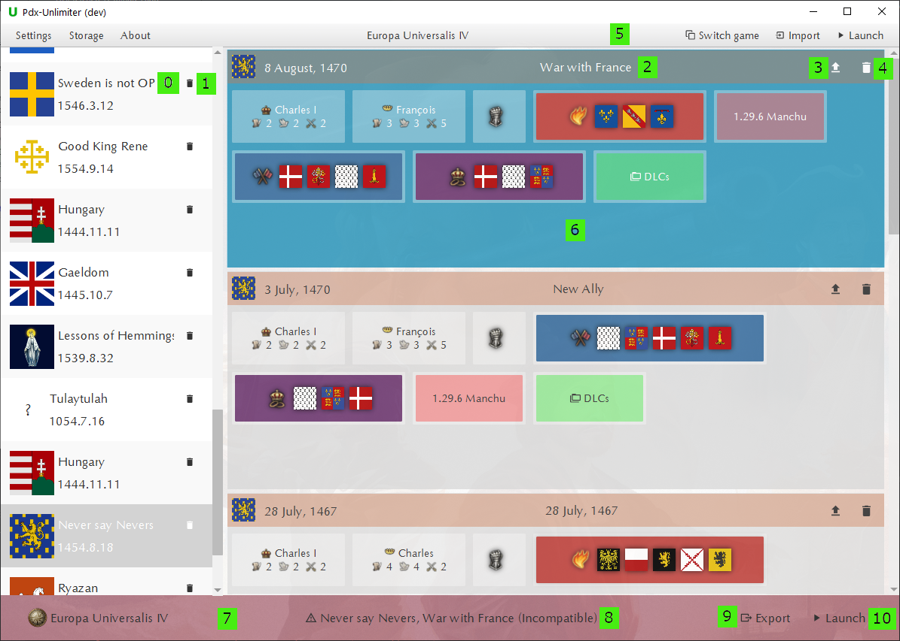
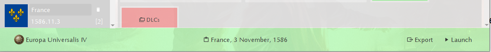

## Pdx-Unlimiter Guide

## Installations

Upon installation, you probably have a lot of savegames of different Paradox games on your computer,
either saved in your documents directories or your Steam cloudsave directories.
The Pdx-Unlimiter will try to automatically detect any of those game installation and save game directories.
If any installation is not detected, you can set them manually in the settings menu.
Note that only up-to-date installations of Paradox games with installed Paradox Launcher are supported!

Furthermore, the Pdx-Unlimiter has an internal savegame
storage independent of the savegame directories of installed games.
You can change its location in the settings menu.
For performance reasons and to prevent the storage from bloating, you have to explicitly
import any savegame that you want to manage.

## Savegame management

The savegame manager interface will look something like this for you:

On the left side you can see a list of every available campaign.
The campaign name **(0)** can be edited by clicking on it.
You can also delete an entire campaign by clicking on the delete button **(1)**.

On the right side, you can see all savegames belonging to the currently opened campaign ordered by date.
You can rename a savegame by clicking on its name **(2)**,
upload it to Rakaly.com by clicking on the upload button **(3)**
and delete it by clicking on the delete button **(4)**.
By clicking on a savegame entry **(6)**, you select it and the status bar **(7)** will appear.
The status bar indicates whether the savegame is compatible and can therefore be launched without any problems.

## Savegame storage

Upon installation, you probably have a lot of savegames of different Paradox games on your computer,
either saved in your documents directories or your Steam cloudsave directories.

The Pdx-Unlimiter has an internal savegame storage that is
independent of these savegame directories of your installed games.
To manage a savegame with the Pdx-Unlimiter, you therefore first have to import it.
There are several different ways of doing that:

- By clicking the import button in the menu bar, which will open a separate import dialog
- Dragging and dropping the savegame files into the Pdx-Unlimiter. This also works for folders that contain savegames
- Pressing `CTRL+SHIFT+I` while a supported game is open will import the latest savegame.
  This also works if the game is in fullscreen mode
  If the key combination is pressed, a confirmation sound will play
- Double clicking any savegame file if its extension is associated with the Pdx-Unlimiter.
  This includes `.eu4` `.hoi4`, `.ck3` and `.sav` files.

The savegame storage is separate 
You can of course change its location in the settings menu.
For performance reasons and to prevent the storage from bloating, you have to explicitly
import any savegame that you want to manage.
This means that changing or deleting a file from your savegame directory
does not delete it from the Pdx-Unlimiter storage and vice-versa.

In the settings menu you can also enable the option `Delete on import` which specifies
whether to delete savegames after succesfully importing it into the Pdx-Unlimiter storage.

## Campaigns and folders

When you import savegames, they are automatically grouped by identifying
other savegames that belong to the same campaign playthrough.
These campaigns are shown on the left and look like this:

In addition to campaigns, you can also create folders by clicking on the **Add Folder** button
shown in the picture.
Next to it is a search bar that you can use to quickly find specific campaigns or savegames.
A folder is meant to store various savegames that might belong to entirely different campaigns.
An example is the **Melted Savegames** folder that stores any converted Ironman savegame.

The campaigns and folders are ordered by how recently a savegame
of that campaign was directly launched from the Pdx-Unlimiter.
If you want to move a savegame to another campaigns or folder, you can do so dragging and dropping it there.

## Savegames

By clicking on a campaign or folder, you can see the contained savegames.

abc

### Status bar

If you click on a savegame entry, a status bar will pop up from the bottom.
It either looks like this:

By clicking the **Export** button in the status bar,
you can copy the savegame into the savegame directory of the current game.
This will however not launch the game automatically.

You can also launch the selected savegame directly by clicking the **Launch** button.
This direct launch will automatically attempt to enable every required mod and dlc.
If some content is missing, or the game version is not compatible, a warning will be shown.
This will bypass the Paradox launcher and main menu, i.e. saving a lot of time.

## Savegame Actions

The icon buttons located at the top right of a savegame entry
indicate what kind of actions you can perform with it.
These buttons perform the following actions:

Ironman converter, only available for Ironman savegames

Copy functionality. This is useful to create backup copies before editing a savegame.

Opens the savegame editor.

Uploads the savegame to [Rakaly.com](https://rakaly.com) to analyze it.
For this to work, you first have to set your Rakaly.com *User ID* and *API key* in the settings menu.
After this is done, you can click the analyze button **(3)** and the selected savegame will be uploaded to Rakaly.

Uploads the savegame to [https://skanderbeg.pm](https://skanderbeg.pm) to generate maps.
a website for savegame maps and statistics.
For this to work, you first have to set your skanderbeg.pm *API key* in the settings menu.

Deletes the savegame.

### Playing

You can launch a selected savegame directly by clicking the launch button **(10)** in the bottom status bar.
This direct launch will automatically attempt to enable every required mod and dlc.
If some content is missing, or the game version is not compatible, a warning will be shown.
This will bypass the Paradox launcher and main menu, i.e. saving a lot of time.

Any supported paradox game can also be started from within the Pdx-Unlimiter even
without selecting a savegame by clicking the `Launch` button in menu bar **(5)**.
This will start the Paradox Launcher and Steam if needed. If you don't want
to start Steam as well, you can disable this feature in the settings.

### Exporting

By clicking the export button **(9)** in the status bar,
you can copy the savegame into the savegame directory of the current game.
This will however not launch the game automatically.

If you want to export a savegame into any other directory,
you can simple drag it from within the Pdx-Unlimiter and drop it where you want.

You can also export the entire storage of the Pdx-Unlimiter into a directory,
by clicking *Storage* -> *Export storage...* in the menu bar **(5)**.
This can be useful to backup your savegame collection or transfer it between different computers.

## Upload to Rakaly.com

The Pdx-Unlimiter supports uploading EU4 savegames to [Rakaly.com](https://rakaly.com).
For this to work, you first have to set your Rakaly.com *User ID* and *API key* in the settings menu.
After this is done, you can click the analyze button **(3)** and the selected savegame will be uploaded to Rakaly.

## Upload to skanderbeg.pm

There is also support to upload savegames to [https://skanderbeg.pm](https://skanderbeg.pm),
a website for savegame maps and statistics.
For this to work, you first have to set your skanderbeg.pm *API key* in the settings menu.

### Reverting

In case of any unfortunate ingame event that you want to revert,
the Pdx-Unlimiter gives you the ability to savescum, i.e. reverting to the previous save when playing in ironman.
By pressing either `CTRL+SHIFT+K` or `Kill` in the status bar,
you can kill the currently running game without it overriding the latest savegame.
You can simply select your latest imported savegame in the Pdx-Unlimiter and launch it again.

### Converting

You can convert ironman savegames into non-ironman savegames by using the 'melt' functionality.
The melt button can be found left to the upload button **(3)** for ironman savegames only and looks like an oven.
From there, you can select the output file name.
Note that you should include the file ending, e.g. `.eu4` in the file name!

## Automatic updates

The Pdx-Unlimiter comes with an autoupdate functionality.
Whenever you launch the Pdx-Unlimiter, it will check for a new version and download it if it exists.
There are several reasons why this was implemented:

- There are currently four supported games where each game gets regular updates.
  In order to maintain support for each of them, new versions of the Pdx-Unlimiter have to be frequently distributed
- To eliminate bugs of course
- The file format of Paradox games is undocumented and messy, therefore
  there will always be unexpected cases that have to be fixed
- Windows SmartScreen makes manual updates unnecessary difficult since each new version is flagged as untrusted.
  You can read more about this [here](https://www.coretechnologies.com/blog/windows/microsoft-smartscreen-filter/)
  
If you want to disable this feature, you can do so in the settings menu.

## Troubleshooting

In case of any problems, you can do the following:

- Use the automatic report functionality of the error reporter if it comes up
- You can also open the issue reporter at 'Help' -> 'Report issue' in the menu bar
- Alternatively, you can also open an issue on GitHub and describe the error in more detail
- If the application does not even start, or you want to dig deeper into the error cause,
  you can find the different log files at `<documents directory>\Pdx-Unlimiter\logs`
  on Windows and `~/.local/share/.pdx-unlimiter/logs` on Linux.
  (If you are an older user, your install path may be your home directory instead of the documents directory)
  
